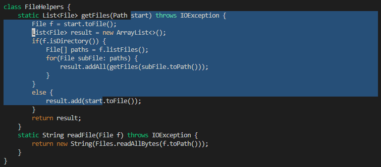
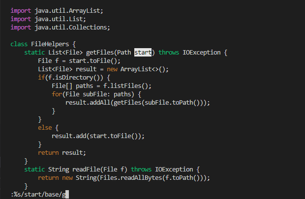
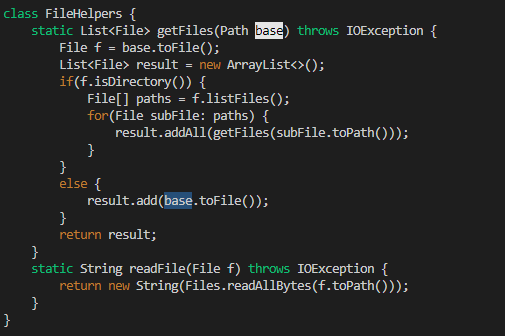

# Lab Report 4 #
## VIM ##

In the lab, we used /(word) to find a single occurrence of the word, and then used delete and insert for our replaced word. We had to do that for every single occurence. This is way more than 30 keys.   

I felt like the way we came up with the lab was very repetitive in trying to replace multiple occurences of a word to another word. It was more or close to the limit of 30 key presses. I decided to do some research and see if there was a faster way to do so in vim. 

Here is our problem, replacing all occurences of start with base.  (One occurence is at the start of the highlight and one at the end. There are more occurences of start in this file but is unable to be fit in a screenshot.)  

We can use this command in normal mode (the default mode).  

`:%s/start/base/g`  

In General Form:  
`:%s/(Word being replaced)/(New Word)/g`

  

For replacing start with base with this command, we can just use 20 key presses (3 more to save and quit vim, :wq) to replace all occurences of start with base. 

All in all, the entire key sequence was:

`:%s/start/base/g<ENTER>:wq`  

## Faster Performance ##

Doing the edit in both styles, in editing hand person and scping to the server and editing in vim. 

The vim one was faster (1min), as I did not have to go in the file and try to find all occurences of start. I also did not have to scp the edited file to the server. (this way took around 1 min and 30 sec) (I know the directions tell me to have the scp command saved, but I consider that work as well since we don't magically have it and we have to do that atleast once) 

I would say it would depend on the type of edit you want to do. It depends if it is a edit that could be finished with vim commands or not. If not,then the editing the file and scping could be faster. 

However, I think that vim will be much faster, especially if I get better at using it and navigating it. 

I would say that if the project has to be in a remote server, I would use vim, but if I can run the project locally in my laptop, I would use editing the file directly. (since I won't have to use scp.)

