## THE INDEX ##

[Lab Report 1](https://github.com/ALDCLAB/cse15l-lab-reports/blob/main/lab_report_1.md)  
[Lab Report 2](https://github.com/ALDCLAB/cse15l-lab-reports/blob/main/lab_report_2.md)  
placeholder for later weeks  
placeholder for later weeks  
placeholder for later weeks  
placeholder for later weeks  
placeholder for later weeks  
placeholder for later weeks  
placeholder for later weeks  
placeholder for later weeks  
placeholder for later weeks  
placeholder for later weeks  


# Lab Report Week 1 #
# Remote Access and The File System #  
## Visual Studio Code ##  
All other steps were done within Visual Studio Code. I already downloaded Visual Studio Code before, so this step was already done for me. From what I remember, I went to the official site and downloaded Visual Studio Code from there.  
  
---  

## Remotely Connecting ##
How to remote connect: ```ssh AccName@servername```    
Type in your password (no need when you have a key setup).  
**For your first type connecting to a server you have not logged in, you will be met with an authenticity warning asking you if you trust the connection or not.**  
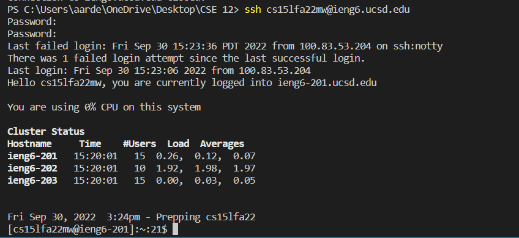  
---  
## Trying Some Commands ##  
Now connected to the server, we can try some commands.
I have tried tons of commands like ```cd```, ```ls```, etc. The ones shown in the image is ```ls -lat``` and ```cat```.  
**What some of these commands do:**  
`cd` - Change directory to the directory specified.  
`ls` and `ls -lat` - Both lists files in the directory. `-lat` is one of the variations of `ls`, as it seems to give more info than just `ls` itself.  
`cat` - The `cat` command as shown in the picture shows the contents of the file that is specified after the command, which in this example was "WhereAmI.java"  
There are many more commands out there to find out and use!  
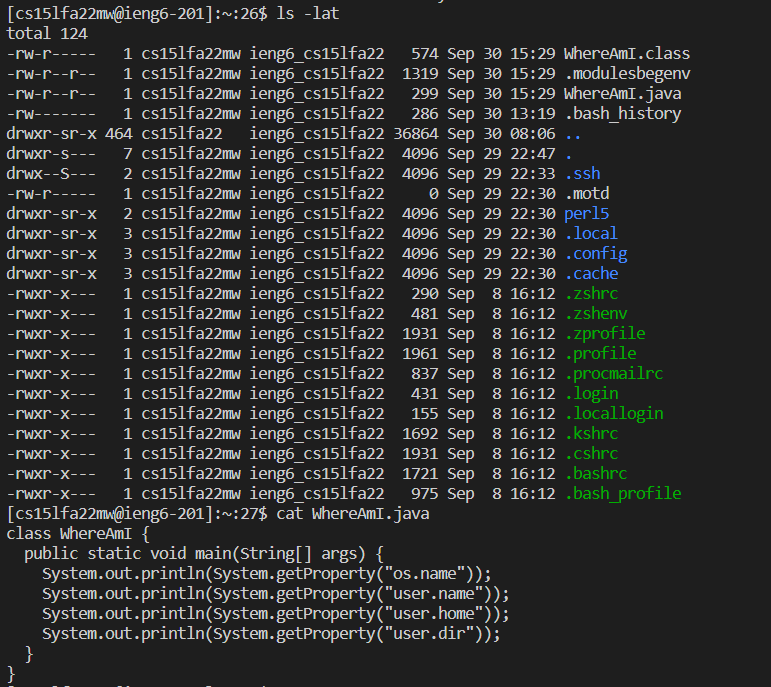  
---  
## Moving files with the scp command ##
For this command, in order to move your files from your client to the server, you must be in the client and **not in the server.**  
How to use the scp command and move files to the server: ```scp FILENAME.java AccName@servername```  
The image shows the scp command moving the WhereAmI java file.  
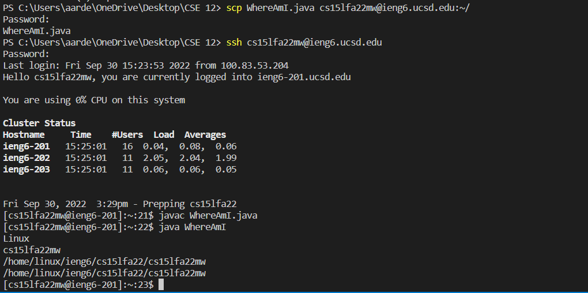
---  
## Setting an SSH Key ##  
We have used the command `ssh-keygen` in order to make our ssh-key. (In my image it told me to overwrite since I already I had a ssh key already)  
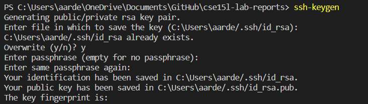  
We then created a directory on the server we want to put our key on. (In my image it did not work because I already had the directory created.)  
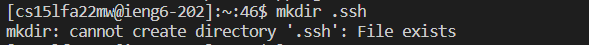  
Then, we have to use the scp command, grabbing our public key and sending it over to the directory.  

```scp /Users/name/.ssh//id.rsa.pub AccName@ServerName:~/.ssh/authorized_keys```  
^the directory of where your public key is located, your account name, and then the directory you want to put the key in the server.  
**Keys are used to avoid the big time waster of putting in your password to your account everytime you want to do something with it (Especialy if you have a long and strong password to protect your accounts with!)**
Here is an image of logging in without needing my password.  
  
---  
## Optimize your Time! ##
There are several tricks or formats people can do to be faster.  
The most useful one is pressing the up arrow key to use past commands done before.  
There are other ones such as putting several commands in one line in this image.  
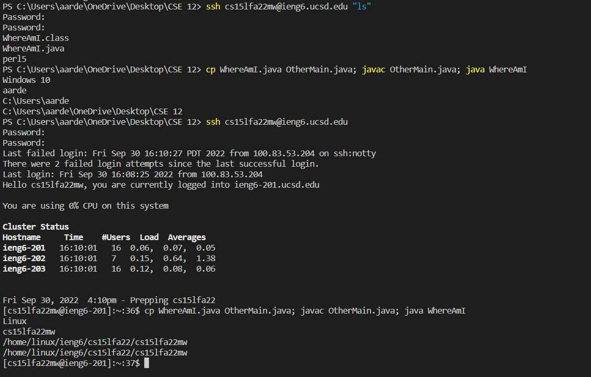       
---

# Lab Report 2 #  
## The World's Simplest Search Engine ##  
Here is my code for the SearchEngine assignment. 


```
public String handleRequest(URI url) {
        if (url.getPath().equals("/")) {
            return String.format("Hello!");
        } else {
            System.out.println("Path: " + url.getPath());
            if (url.getPath().contains("/add")) {
                String[] parameters = url.getQuery().split("=");
                if(parameters[0].equals("s")) {
                    search.add(parameters[1]);
                    return String.format(parameters[1]);
                }
            }
            else if (url.getPath().contains("/search")) {
                String[] parameters = url.getQuery().split("=");
                if(parameters[0].equals("s")) {
                    for (i = 0; i < search.size() - 1; i++) {
                        temp = search.get(i);
                        if(temp.contains(parameters[1])) {
                            containSearch.add(temp);

                        }
                    }
                    searchResult = containSearch.toString();
                    return String.format(searchResult);
                }
            return "404 Not Found!";
            }
        }
        return "Hello!";
    }
}
```  

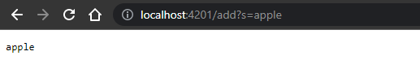  
With `/add?s=word` added to the URL, it goes thru the if statement, denys the first if statement, since the URL path does not only equal "/."  

It then goes to the else statement where it checks the first if statement inside, and see if the url contains "/add." When that is true (which it is in the screenshot), it splits the next url lines when there is a "=." It then puts the strings in an array called parameters.  

It then goes to another if statement checking the first split string is equal to "s." If it does, it adds the second split string to search, which is an array list. This array list named search is responsible for storing all the words added. This will help our search function whn it is used later.  

That is the entire add function of this searchEngine. 

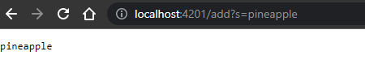  
  
For this example, I also added these words in order to demonstrate the search function. The same methods are called, and they join apple along in the ArrayList. 

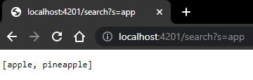  
For the search function, it checks if the url contains "/search" in it. 
If it does, it does the same parameter stuff just like the add if statement discussed earlier.  

It then goes to a for loop, looping the number of `search.size - 1` For every index inside of the search array (which is dependent on how many you added), the temp variable is assigned to it, which then is used to see if that index of temp contains the words of `parameters[1]` (Your desired search word). 

If the temp variable has it, it is added to another array list called `containSearch`. This repeats until each word in the search array is checked if they have contained the search word.  

Then the final part of the search statement is that it turns the array of the words added that has the word search (containSearch) and turns it into a string, and then returns it to the site to be seen. 
---  

## Debugging ##  
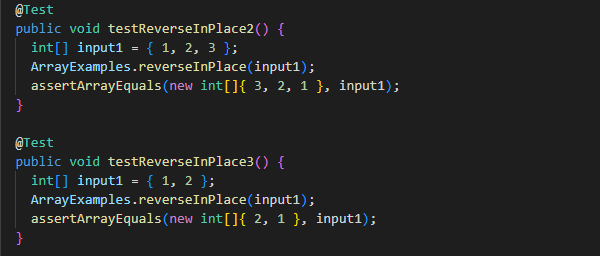  
The test code.  
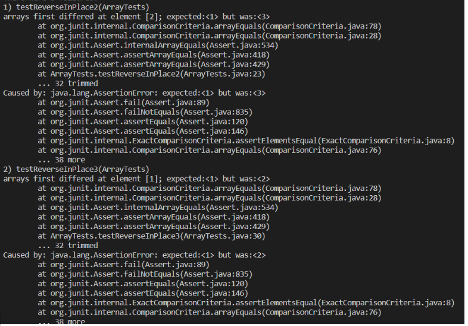  
The failing test output of those two tests.  
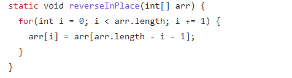  
The code bug, specifically the `arr[i] = arr[arr.length - i - 1];` line.  
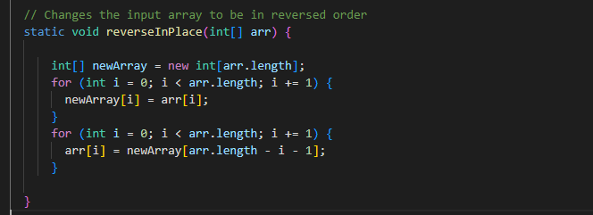  
The new code to fix the bug.  
The problem with the original code was that when you reach a certain point of your array that is big (atleast a size of 2 or 3), it would try to assign the number of an index that has already changed. In my example code, the first test, when it trys to change index 2 into 1, it could not as index 0 was already assigned 3. This is why the beginning part of the array is fine but leaning towards the end it was not. 

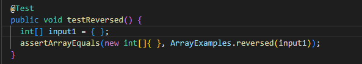    
The test code.  
  
The error.  
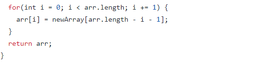  
The code needed to be fixed.  
  
The fixed code.  
The code that needed to be fixed was assigning the original array instead of the new array that needed to returned. It also returned the wrong array. This made it so the newArray was not getting assigned at all and wasn't even the result. 
