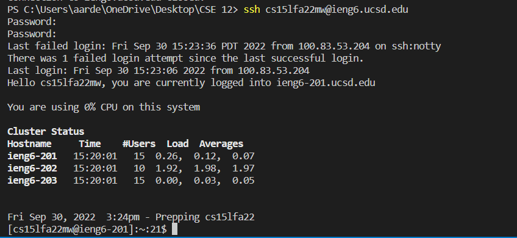
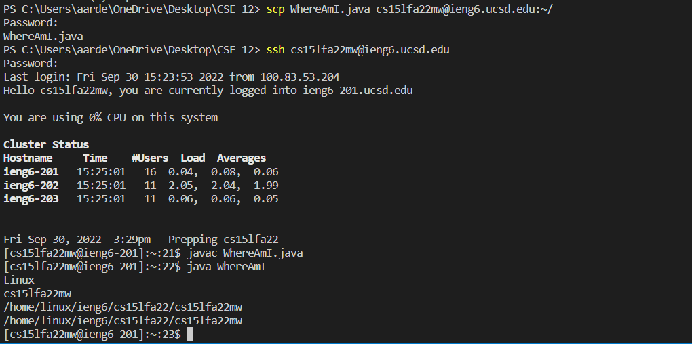
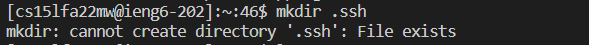

# Remote Access and The File System #  
## Visual Studio Code ##  
All other steps were done within Visual Studio Code. I already downloaded Visual Studio Code before, so this step was already done for me. From what I remember, I went to the official site and downloaded Visual Studio Code from there.  
  
---  

## Remotely Connecting ##
How to remote connect: ```ssh AccName@servername```    
Type in your password (no need when you have a key setup).  
**For your first type connecting to a server you have not logged in, you will be met with an authenticity warning asking you if you trust the connection or not.**  
  
---  
## Trying Some Commands ##  
Now connected to the server, we can try some commands.
I have tried tons of commands like ```cd```, ```ls```, etc. The ones shown in the image is ```ls -lat``` and ```cat```.  
**What some of these commands do:**  
`cd` - Change directory to the directory specified.  
`ls` and `ls -lat` - Both lists files in the directory. `-lat` is one of the variations of `ls`, as it seems to give more info than just `ls` itself.  
`cat` - The `cat` command as shown in the picture shows the contents of the file that is specified after the command, which in this example was "WhereAmI.java"  
There are many more commands out there to find out and use!  
  
---  
## Moving files with the scp command ##
For this command, in order to move your files from your client to the server, you must be in the client and **not in the server.**  
How to use the scp command and move files to the server: ```scp FILENAME.java AccName@servername```  
The image shows the scp command moving the WhereAmI java file.  

---  
## Setting an SSH Key ##  
We have used the command `ssh-keygen` in order to make our ssh-key. (In my image it told me to overwrite since I already I had a ssh key already)  
  
We then created a directory on the server we want to put our key on. (In my image it did not work because I already had the directory created.)  
  
Then, we have to use the scp command, grabbing our public key and sending it over to the directory.  

```scp /Users/name/.ssh//id.rsa.pub AccName@ServerName:~/.ssh/authorized_keys```  
^the directory of where your public key is located, your account name, and then the directory you want to put the key in the server.  
**Keys are used to avoid the big time waster of putting in your password to your account everytime you want to do something with it (Especialy if you have a long and strong password to protect your accounts with!)**
Here is an image of logging in without needing my password.  
  
---  
## Optimize your Time! ##
There are several tricks or formats people can do to be faster.  
The most useful one is pressing the up arrow key to use past commands done before.  
There are other ones such as putting several commands in one line in this image.  
   
