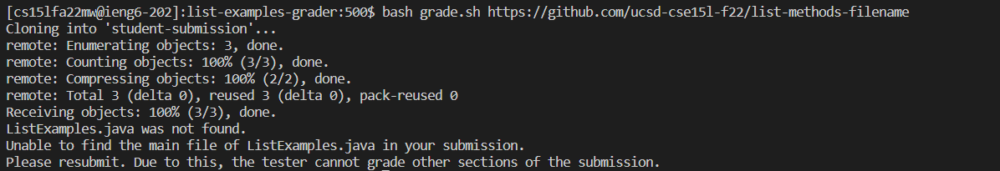

# Lab Report 5 #  
## Grading Script ##  
My grade.sh script:
```
set -e

rm -rf student-submission

git clone $1 student-submission

cd student-submission

if [[ -f ListExamples.java ]]
then
    echo "ListExamples.java is able to be found!"
    echo "Successfully  loaded file. +9000 points."
else
    echo "ListExamples.java was not found."
    echo "Unable to find the main file of ListExamples.java in your submission."
    echo "Please resubmit. Due to this, the tester cannot grade other sections of the submission."
    exit
fi

cd ../

cp TestListExamples.java student-submission/

cp -r lib student-submission

cd student-submission

javac -cp .:lib/hamcrest-core-1.3.jar:lib/junit-4.13.2.jar *.java
java -cp .:lib/hamcrest-core-1.3.jar:lib/junit-4.13.2.jar org.junit.runner.JUnitCore TestListExamples

```  
Here is three screenshots of different example submissions.  
Default Basic Lab Submission:  
  
Wrong Filename Submission:  
  
Corrected Submission:  
  

Trace grade.sh with Wrong Filename Submission:  
`set -e` Makes the script exit immediately if a command exits with a status that is not zero. This would mean that every line here ends with the status of zero if it has performed.    
`rm -rf student-submission` Removes the directory named "student-submission" and all the files under the directory. This line is to remove any information from the previous use of this script and directory.  
`git clone $1 student submission` Clones the first argument of the script to the directory of "student-submission". This recreates the directory and puts the student submission into the directory of "student-submission". In this case, it puts `https://github.com/ucsd-cse15l-f22/list-methods-filename` into the directory of student-submission.  
`cd student-submission` Redirects the script inside of the directory of student-submission.  
`if [[ -f ListExamples.java ]]` is false because there is no filename named "ListExamples.java" inside the student-submission directory.  
This means the lines:
```
then
    echo "ListExamples.java is able to be found!"
    echo "Successfully  loaded file. +9000 points."
```
is not performed due to the if statement being false. 
```
else
    echo "ListExamples.java was not found."
    echo "Unable to find the main file of ListExamples.java in your submission."
    echo "Please resubmit. Due to this, the tester cannot grade other sections of the submission."
    exit
```
This else statement is run due to the if statement being false. It displays these echo arguments to the reader and sends some feedback of why there is an error to the grader, which is dueto no file named "ListExamples.java" in their submission. It tells them to resubmit again and why they received no points in other parts of the submission. It then exits and ends the script.  

```
fi

cd ../

cp TestListExamples.java student-submission/

cp -r lib student-submission

cd student-submission

javac -cp .:lib/hamcrest-core-1.3.jar:lib/junit-4.13.2.jar *.java
java -cp .:lib/hamcrest-core-1.3.jar:lib/junit-4.13.2.jar org.junit.runner.JUnitCore TestListExamples
```
The rest of the lines in this code block are not executed due to the exit command. 