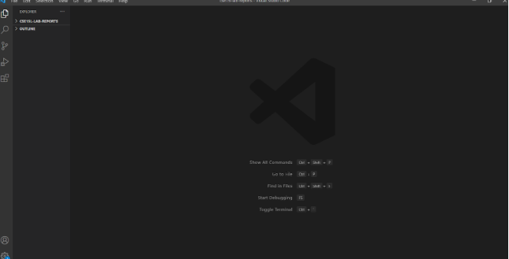
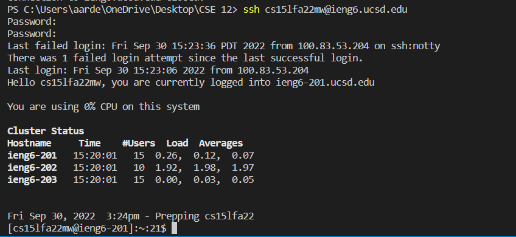
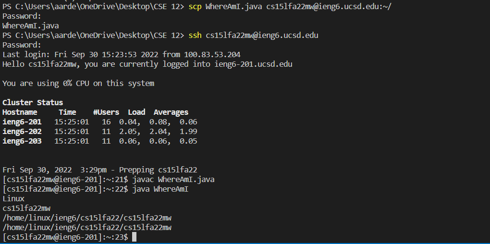
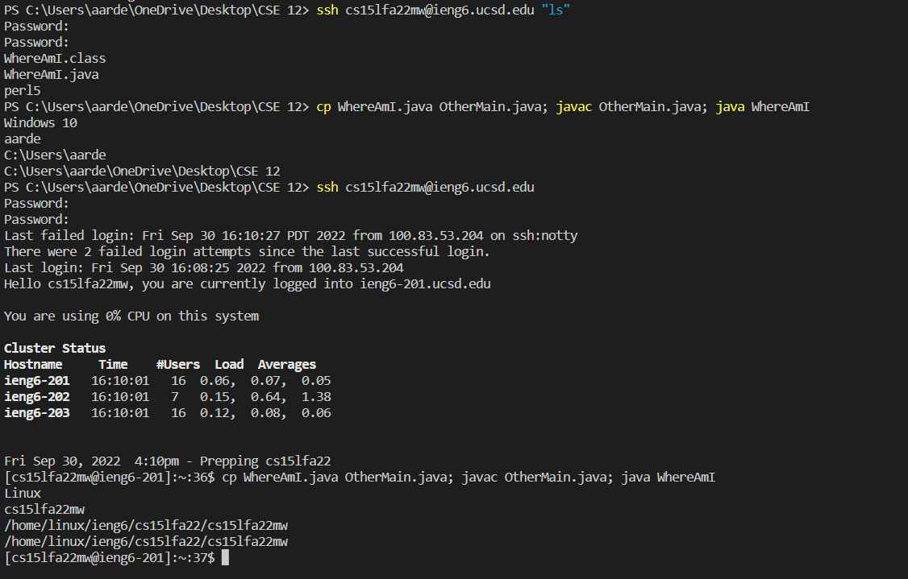

# Remote Access and The File System #  
## Visual Studio Code ##  
All other steps were done within Visual Studio Code. I already downloaded Visual Studio Code before, so this step was already done for me. From what I remember, I went to the official site and downloaded Visual Studio Code from there.  
  
---  

## Remotely Connecting ##
How to remote connect: ```ssh AccName@servername```    
Type in your password (no need when you have a key setup).  
**For your first type connecting to a server you have not logged in, you will be met with an authenticity warning asking you if you trust the connection or not.**  
  
---  
## Trying Some Commands ##  
Now connected to the server, we can try some commands.
I have tried tons of commands like ```cd```, ```cp```, ```ls```, etc. The ones shown in the image is ```ls -lat``` and ```cat```.  
  
---  
## Moving files with the scp command ##
For this command, in order to move your files from your client to the server, you must be in the client and **not in the server.**  
How to use the scp command and move files to the server: ```scp FILENAME.java AccName@servername```  
The image shows the scp command moving the WhereAmI java file.  

---  
## Setting an SSH Key ##  
For the moment of posting this, I still have technicnal issues of making a key.
For now, the part I am stuck on is trying to move the key into the server. 
Keys are used to avoid the big time waster of putting in your password to your account everytime you want to do something with it.  
Image Placeholder.  
---  
## Optimize your Time! ##
There are several tricks or formats people can do to be faster.  
The most useful one is pressing the up arrow key to use past commands done before.  
There are other ones such as putting several commands in one line in this image.  
   
