## THE INDEX ##

[Lab Report 1](https://github.com/ALDCLAB/cse15l-lab-reports/blob/main/lab_report_1.md)  
[Lab Report 2](https://github.com/ALDCLAB/cse15l-lab-reports/blob/main/lab_report_2.md)  
[Lab Report 3](https://github.com/ALDCLAB/cse15l-lab-reports/blob/main/lab_report_3.md)] 
placeholder for later weeks  
placeholder for later weeks  
placeholder for later weeks  
placeholder for later weeks  
placeholder for later weeks  
placeholder for later weeks  
placeholder for later weeks  
placeholder for later weeks  
placeholder for later weeks  


# Lab Report Week 1 #
# Remote Access and The File System #  
## Visual Studio Code ##  
All other steps were done within Visual Studio Code. I already downloaded Visual Studio Code before, so this step was already done for me. From what I remember, I went to the official site and downloaded Visual Studio Code from there.  
  
---  

## Remotely Connecting ##
How to remote connect: ```ssh AccName@servername```    
Type in your password (no need when you have a key setup).  
**For your first type connecting to a server you have not logged in, you will be met with an authenticity warning asking you if you trust the connection or not.**  
  
---  
## Trying Some Commands ##  
Now connected to the server, we can try some commands.
I have tried tons of commands like ```cd```, ```ls```, etc. The ones shown in the image is ```ls -lat``` and ```cat```.  
**What some of these commands do:**  
`cd` - Change directory to the directory specified.  
`ls` and `ls -lat` - Both lists files in the directory. `-lat` is one of the variations of `ls`, as it seems to give more info than just `ls` itself.  
`cat` - The `cat` command as shown in the picture shows the contents of the file that is specified after the command, which in this example was "WhereAmI.java"  
There are many more commands out there to find out and use!  
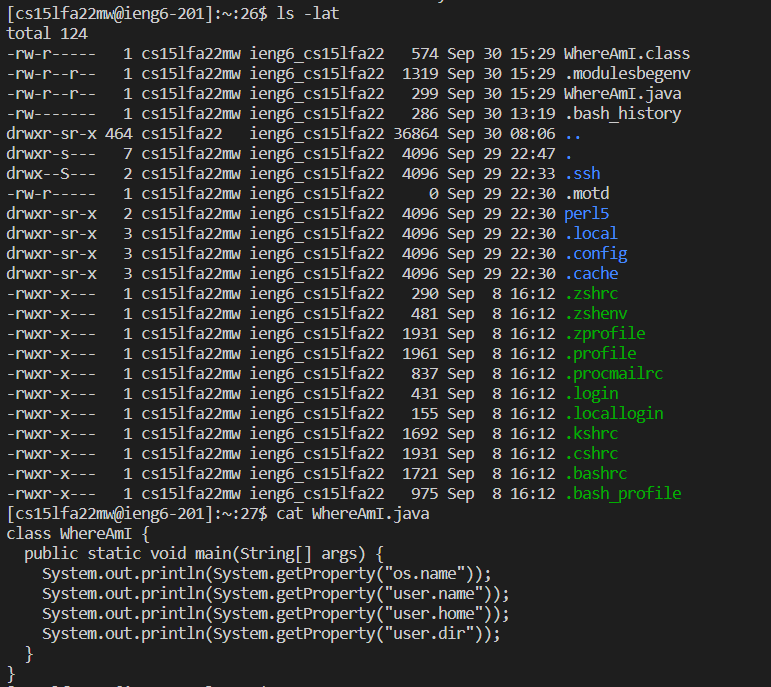  
---  
## Moving files with the scp command ##
For this command, in order to move your files from your client to the server, you must be in the client and **not in the server.**  
How to use the scp command and move files to the server: ```scp FILENAME.java AccName@servername```  
The image shows the scp command moving the WhereAmI java file.  

---  
## Setting an SSH Key ##  
We have used the command `ssh-keygen` in order to make our ssh-key. (In my image it told me to overwrite since I already I had a ssh key already)  
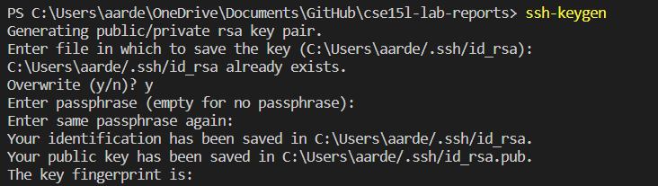  
We then created a directory on the server we want to put our key on. (In my image it did not work because I already had the directory created.)  
  
Then, we have to use the scp command, grabbing our public key and sending it over to the directory.  

```scp /Users/name/.ssh//id.rsa.pub AccName@ServerName:~/.ssh/authorized_keys```  
^the directory of where your public key is located, your account name, and then the directory you want to put the key in the server.  
**Keys are used to avoid the big time waster of putting in your password to your account everytime you want to do something with it (Especialy if you have a long and strong password to protect your accounts with!)**
Here is an image of logging in without needing my password.  
  
---  
## Optimize your Time! ##
There are several tricks or formats people can do to be faster.  
The most useful one is pressing the up arrow key to use past commands done before.  
There are other ones such as putting several commands in one line in this image.  
       
---

# Lab Report 2 #  
## The World's Simplest Search Engine ##  
Here is my code for the SearchEngine assignment. 


```
public String handleRequest(URI url) {
        if (url.getPath().equals("/")) {
            return String.format("Hello!");
        } else {
            System.out.println("Path: " + url.getPath());
            if (url.getPath().contains("/add")) {
                String[] parameters = url.getQuery().split("=");
                if(parameters[0].equals("s")) {
                    search.add(parameters[1]);
                    return String.format(parameters[1]);
                }
            }
            else if (url.getPath().contains("/search")) {
                String[] parameters = url.getQuery().split("=");
                if(parameters[0].equals("s")) {
                    for (i = 0; i < search.size() - 1; i++) {
                        temp = search.get(i);
                        if(temp.contains(parameters[1])) {
                            containSearch.add(temp);

                        }
                    }
                    searchResult = containSearch.toString();
                    return String.format(searchResult);
                }
            return "404 Not Found!";
            }
        }
        return "Hello!";
    }
}
```  

  
With `/add?s=word` added to the URL, it goes thru the if statement, denys the first if statement, since the URL path does not only equal "/."  

It then goes to the else statement where it checks the first if statement inside, and see if the url contains "/add." When that is true (which it is in the screenshot), it splits the next url lines when there is a "=." It then puts the strings in an array called parameters.  

It then goes to another if statement checking the first split string is equal to "s." If it does, it adds the second split string to search, which is an array list. This array list named search is responsible for storing all the words added. This will help our search function whn it is used later.  

That is the entire add function of this searchEngine. 

  
  
For this example, I also added these words in order to demonstrate the search function. The same methods are called, and they join apple along in the ArrayList. 

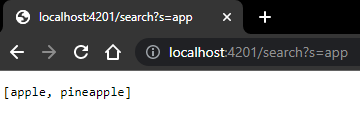  
For the search function, it checks if the url contains "/search" in it. 
If it does, it does the same parameter stuff just like the add if statement discussed earlier.  

It then goes to a for loop, looping the number of `search.size - 1` For every index inside of the search array (which is dependent on how many you added), the temp variable is assigned to it, which then is used to see if that index of temp contains the words of `parameters[1]` (Your desired search word). 

If the temp variable has it, it is added to another array list called `containSearch`. This repeats until each word in the search array is checked if they have contained the search word.  

Then the final part of the search statement is that it turns the array of the words added that has the word search (containSearch) and turns it into a string, and then returns it to the site to be seen. 
---  

## Debugging ##  
  
The test code.  
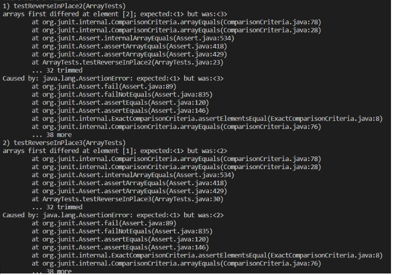  
The failing test output of those two tests.  
  
The code bug, specifically the `arr[i] = arr[arr.length - i - 1];` line.  
  
The new code to fix the bug.  
The problem with the original code was that when you reach a certain point of your array that is big (atleast a size of 2 or 3), it would try to assign the number of an index that has already changed. In my example code, the first test, when it trys to change index 2 into 1, it could not as index 0 was already assigned 3. This is why the beginning part of the array is fine but leaning towards the end it was not. 

    
The test code.  
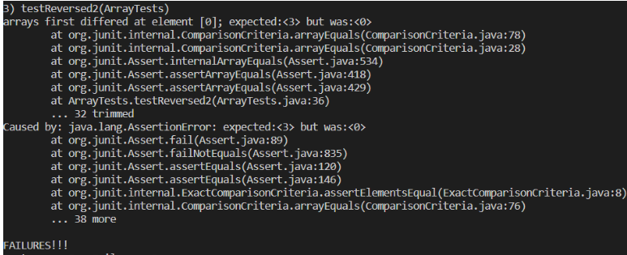  
The error.  
  
The code needed to be fixed.  
  
The fixed code.  
The code that needed to be fixed was assigning the original array instead of the new array that needed to returned. It also returned the wrong array. This made it so the newArray was not getting assigned at all and wasn't even the result. 

# Lab Report 3 #  
## grep command ##  
```-R```  
```grep -R [Search Word/Phrase] [Directory]```  
The command option -R of the grep command lets you be able to search for a word or phrase for all the files in a directory. This is useful when it is needed to find relevant files in a huge folder of files.  
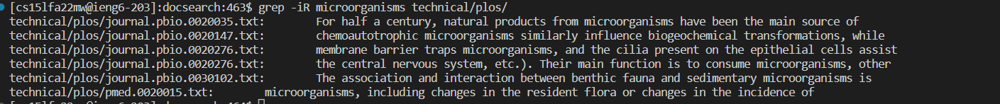
```
grep -iR microorganisms technical/plos/
technical/plos/journal.pbio.0020035.txt:        For half a century, natural products from microorganisms have been the main source of
technical/plos/journal.pbio.0020147.txt:        chemoautotrophic microorganisms similarly influence biogeochemical transformations, while
technical/plos/journal.pbio.0020276.txt:        membrane barrier traps microorganisms, and the cilia present on the epithelial cells assist
technical/plos/journal.pbio.0020276.txt:        the central nervous system, etc.). Their main function is to consume microorganisms, other
technical/plos/journal.pbio.0030102.txt:        The association and interaction between benthic fauna and sedimentary microorganisms is
technical/plos/pmed.0020015.txt:        microorganisms, including changes in the resident flora or changes in the incidence of
```  
(the command here is `-iR` to avoid any case sensitive problems.)
In this example, it tells you all the files that have the word "microorganisms" in it, showing which files are related to the searched word or phrase. This is useful if you wanted information about microorganisms, as now you know which files to go to that are relevant to your search.  

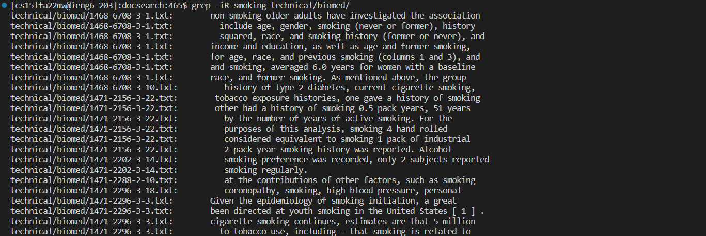  

```
grep -iR smoking technical/biomed/
technical/biomed/1468-6708-3-1.txt:        non-smoking older adults have investigated the association
technical/biomed/1468-6708-3-1.txt:          include age, gender, smoking (never or former), history
technical/biomed/1468-6708-3-1.txt:          squared, race, and smoking history (former or never), and
technical/biomed/1468-6708-3-1.txt:        income and education, as well as age and former smoking,
technical/biomed/1468-6708-3-1.txt:        for age, race, and previous smoking (columns 1 and 3), and
technical/biomed/1468-6708-3-1.txt:        and smoking, averaged 6.0 years for women with a baseline
technical/biomed/1468-6708-3-1.txt:        race, and former smoking. As mentioned above, the group
technical/biomed/1468-6708-3-10.txt:          history of type 2 diabetes, current cigarette smoking,
technical/biomed/1471-2156-3-22.txt:        tobacco exposure histories, one gave a history of smoking
technical/biomed/1471-2156-3-22.txt:        other had a history of smoking 0.5 pack years, 51 years
technical/biomed/1471-2156-3-22.txt:          by the number of years of active smoking. For the
technical/biomed/1471-2156-3-22.txt:          purposes of this analysis, smoking 4 hand rolled
technical/biomed/1471-2156-3-22.txt:          considered equivalent to smoking 1 pack of industrial
technical/biomed/1471-2156-3-22.txt:          2-pack year smoking history was reported. Alcohol
technical/biomed/1471-2202-3-14.txt:          smoking preference was recorded, only 2 subjects reported
technical/biomed/1471-2202-3-14.txt:          smoking regularly.
technical/biomed/1471-2288-2-10.txt:          at the contributions of other factors, such as smoking
technical/biomed/1471-2296-3-18.txt:          coronopathy, smoking, high blood pressure, personal
technical/biomed/1471-2296-3-3.txt:        Given the epidemiology of smoking initiation, a great
technical/biomed/1471-2296-3-3.txt:        been directed at youth smoking in the United States [ 1 ] .

The list continues on...
```
Here is a `iR` search of the word "smoking" in the technical/biomed/ folder. Now, if all the files here are talking about the correct "smoking" topic, you have tons of files to read up on smoking!  

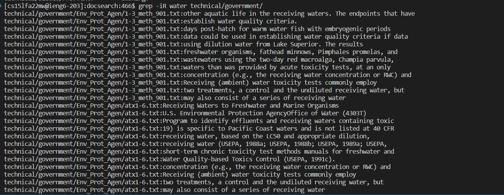
```
technical/government/Env_Prot_Agen/1-3_meth_901.txt:other aquatic life in the receiving waters. The endpoints that have
technical/government/Env_Prot_Agen/1-3_meth_901.txt:establish water quality criteria.
technical/government/Env_Prot_Agen/1-3_meth_901.txt:days post-hatch for warm water fish with embryogenic periods
technical/government/Env_Prot_Agen/1-3_meth_901.txt:data could be used in establishing water quality criteria if data
technical/government/Env_Prot_Agen/1-3_meth_901.txt:using dilution water from Lake Superior. The results
technical/government/Env_Prot_Agen/1-3_meth_901.txt:freshwater organisms, fathead minnows, Pimphales promelas, and
technical/government/Env_Prot_Agen/1-3_meth_901.txt:wastewaters using the two-day red macroalga, Champia parvula,
technical/government/Env_Prot_Agen/1-3_meth_901.txt:waters than was provided by acute toxicity tests, at an only
technical/government/Env_Prot_Agen/1-3_meth_901.txt:concentration (e.g., the receiving water concentration or RWC) and
technical/government/Env_Prot_Agen/1-3_meth_901.txt:Receiving (ambient) water toxicity tests commonly employ
technical/government/Env_Prot_Agen/1-3_meth_901.txt:two treatments, a control and the undiluted receiving water, but
technical/government/Env_Prot_Agen/1-3_meth_901.txt:may also consist of a series of receiving water
technical/government/Env_Prot_Agen/atx1-6.txt:Receiving Waters to Freshwater and Marine Organisms
technical/government/Env_Prot_Agen/atx1-6.txt:U.S. Environmental Protection AgencyOffice of Water (4303T)
technical/government/Env_Prot_Agen/atx1-6.txt:Program to identify effluents and receiving waters containing toxic
technical/government/Env_Prot_Agen/atx1-6.txt:19) is specific to Pacific Coast waters and is not listed at 40 CFR
technical/government/Env_Prot_Agen/atx1-6.txt:receiving water, based on the LC50 and appropriate dilution,
technical/government/Env_Prot_Agen/atx1-6.txt:receiving water (USEPA, 1988a; USEPA, 1988b; USEPA, 1989a; USEPA,

The list continues...
```  
Here is an example of the `grep -iR` command with water on the government directory. we haven't mentioned this yet, but the command also shows everytime it is mentioned in the same file, to show how much they talked about the topic, which is in this case, is water.  

```-N```  
```grep -n [Search Word/Phrase] [FileName]```  
The command option `-n` of the grep command lets you be able to search for the search word phrase inside of a file. If it finds it, it shows you the line of where it is at. This is quite useful to do when you are in a huge file with tons of text or code in it.  
  
```
grep -n microorganisms technical/plos/journal.pbio.0020035.txt
6:        For half a century, natural products from microorganisms have been the main source of
```  
Here, we use `grep -n` on a file in technical/plos/ . It shows that the file only mentioned microorganisms once and only on line 6 of the file. Seeing that it is only one mention, it is either a small file or the main point of the file is something else.  

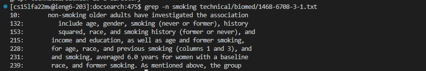  
```
grep -n smoking technical/biomed/1468-6708-3-1.txt
10:        non-smoking older adults have investigated the association
132:          include age, gender, smoking (never or former), history
153:          squared, race, and smoking history (former or never), and
215:        income and education, as well as age and former smoking,
228:        for age, race, and previous smoking (columns 1 and 3), and
231:        and smoking, averaged 6.0 years for women with a baseline
239:        race, and former smoking. As mentioned above, the group
```  
Here, we use `grep -n` on a file in technical/biomed/ (that we found on the last command with `-iR`!). It shows that the file mentioned  smoking on multiple lines, like on line 132. Looking at the lines, we can also tell that it is a decently sized file of text and talks about smoking in some kind of way.  

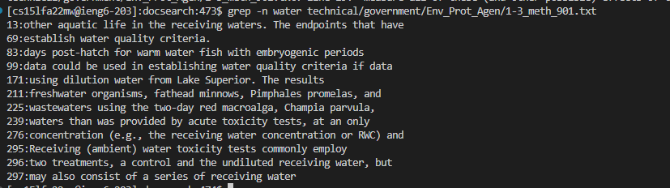  
```
 grep -n water technical/government/Env_Prot_Agen/1-3_meth_901.txt
13:other aquatic life in the receiving waters. The endpoints that have
69:establish water quality criteria.
83:days post-hatch for warm water fish with embryogenic periods
99:data could be used in establishing water quality criteria if data
171:using dilution water from Lake Superior. The results
211:freshwater organisms, fathead minnows, Pimphales promelas, and
225:wastewaters using the two-day red macroalga, Champia parvula,
239:waters than was provided by acute toxicity tests, at an only
276:concentration (e.g., the receiving water concentration or RWC) and
295:Receiving (ambient) water toxicity tests commonly employ
296:two treatments, a control and the undiluted receiving water, but
297:may also consist of a series of receiving water
```  
Here, we use `grep -n` on a file in technical/government/Env_Prot_Agen/.
It shows that this is a decently large file, and water is somewhat plays a part in the topic that is discussed in the file.  

```-A & -B```
`grep -(A or B) [Number of Lines Wanted] [Search Word/Phrase] [FileName]`  
The command options `-A` and `B` of the grep command lets you be able to see the lines **AFTER** or **BEFORE** the line that the searched word or phrase is in. You can choose how many lines before and after you want to see. This helps fiute out what the file topic is about and if it is the thing you are looking for.  

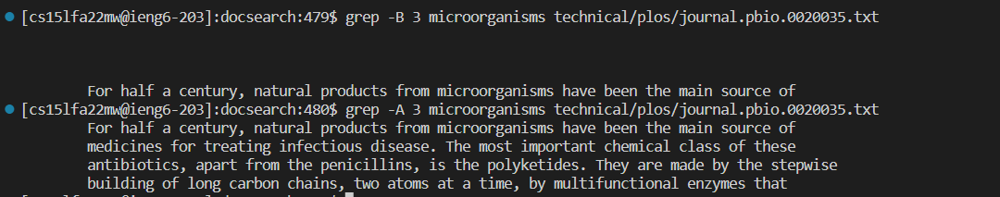  
```
grep -B 3 microorganisms technical/plos/journal.pbio.0020035.txt
    
      
        
        For half a century, natural products from microorganisms have been the main source of
grep -A 3 microorganisms technical/plos/journal.pbio.0020035.txt
        For half a century, natural products from microorganisms have been the main source of
        medicines for treating infectious disease. The most important chemical class of these
        antibiotics, apart from the penicillins, is the polyketides. They are made by the stepwise
        building of long carbon chains, two atoms at a time, by multifunctional enzymes that
```  
We used `grep -B` and `grep-A` in the same file that we used in the `-n` example in the technical/plos/ directory. For this example, since the word microorganisms was located on the first line that had text in the file, it had only provided empty lines before it. We choose 3 lines, so it showed the 3 lines before and after the microorganisms.  

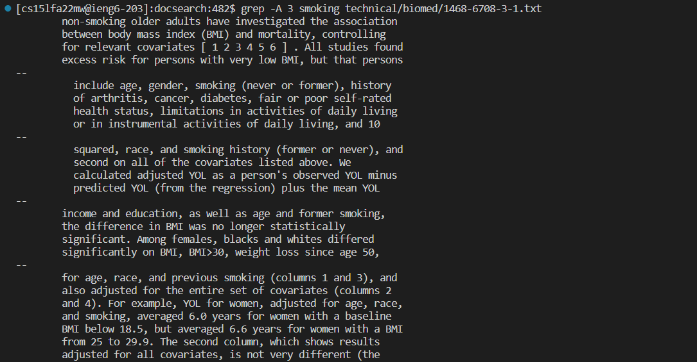  
```
grep -A 3 smoking technical/biomed/1468-6708-3-1.txt
        non-smoking older adults have investigated the association
        between body mass index (BMI) and mortality, controlling
        for relevant covariates [ 1 2 3 4 5 6 ] . All studies found
        excess risk for persons with very low BMI, but that persons
--
          include age, gender, smoking (never or former), history
          of arthritis, cancer, diabetes, fair or poor self-rated
          health status, limitations in activities of daily living
          or in instrumental activities of daily living, and 10
--
          squared, race, and smoking history (former or never), and
          second on all of the covariates listed above. We
          calculated adjusted YOL as a person's observed YOL minus
          predicted YOL (from the regression) plus the mean YOL
--
        income and education, as well as age and former smoking,
        the difference in BMI was no longer statistically
        significant. Among females, blacks and whites differed
        significantly on BMI, BMI>30, weight loss since age 50,
--
        for age, race, and previous smoking (columns 1 and 3), and
        also adjusted for the entire set of covariates (columns 2
        and 4). For example, YOL for women, adjusted for age, race,
        and smoking, averaged 6.0 years for women with a baseline
        BMI below 18.5, but averaged 6.6 years for women with a BMI
        from 25 to 29.9. The second column, which shows results
        adjusted for all covariates, is not very different (the

The list continues...
```  

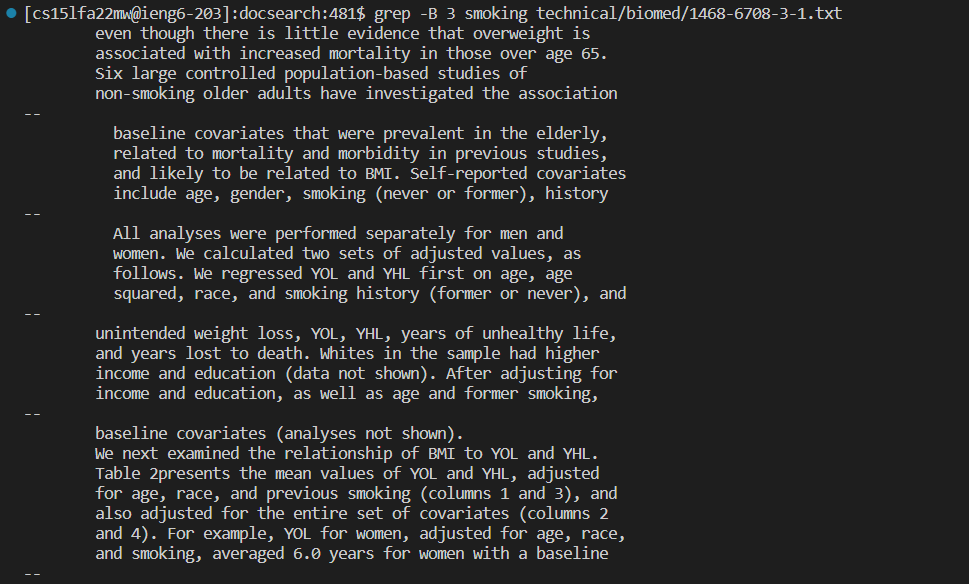  
```
grep -B 3 smoking technical/biomed/1468-6708-3-1.txt
        even though there is little evidence that overweight is
        associated with increased mortality in those over age 65.
        Six large controlled population-based studies of
        non-smoking older adults have investigated the association
--
          baseline covariates that were prevalent in the elderly,
          related to mortality and morbidity in previous studies,
          and likely to be related to BMI. Self-reported covariates
          include age, gender, smoking (never or former), history
--
          All analyses were performed separately for men and
          women. We calculated two sets of adjusted values, as
          follows. We regressed YOL and YHL first on age, age
          squared, race, and smoking history (former or never), and
--
        unintended weight loss, YOL, YHL, years of unhealthy life,
        and years lost to death. Whites in the sample had higher
        income and education (data not shown). After adjusting for
        income and education, as well as age and former smoking,
--
        baseline covariates (analyses not shown).
        We next examined the relationship of BMI to YOL and YHL.
        Table 2presents the mean values of YOL and YHL, adjusted
        for age, race, and previous smoking (columns 1 and 3), and
        also adjusted for the entire set of covariates (columns 2
        and 4). For example, YOL for women, adjusted for age, race,
        and smoking, averaged 6.0 years for women with a baseline

The list continues...
```  
For this example, we can see that multiple mentions of the word search and phrase are considered and the command shows all the lines before or after of all the lines that mentions the word phrase, depending whether you are using `-A` or `-B`. These two commands let us be able to see the tpic of the file better. We can see that this file is the evaluating the data and correlation of a healthy body and smoking in certain age groups.  

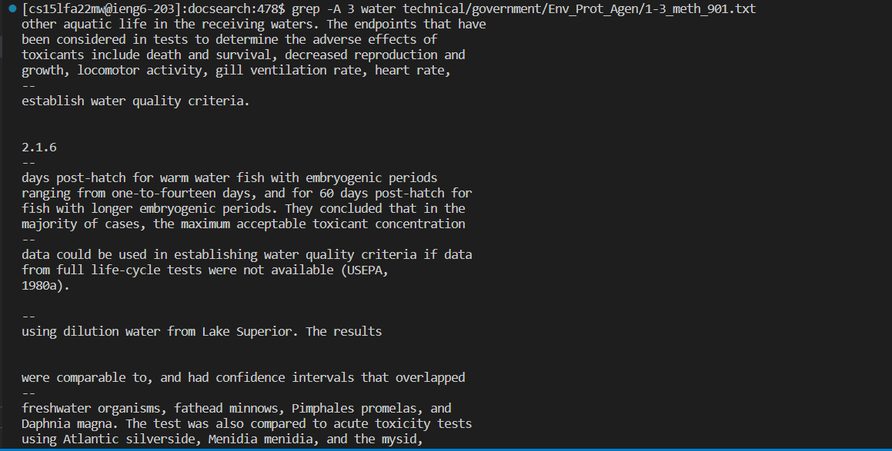
```
grep -A 3 water technical/government/Env_Prot_Agen/1-3_meth_901.txt
other aquatic life in the receiving waters. The endpoints that have
been considered in tests to determine the adverse effects of
toxicants include death and survival, decreased reproduction and
growth, locomotor activity, gill ventilation rate, heart rate,
--
establish water quality criteria.


2.1.6
--
days post-hatch for warm water fish with embryogenic periods
ranging from one-to-fourteen days, and for 60 days post-hatch for
fish with longer embryogenic periods. They concluded that in the
majority of cases, the maximum acceptable toxicant concentration
--
data could be used in establishing water quality criteria if data
from full life-cycle tests were not available (USEPA,
1980a).

--
using dilution water from Lake Superior. The results


were comparable to, and had confidence intervals that overlapped
--
freshwater organisms, fathead minnows, Pimphales promelas, and
Daphnia magna. The test was also compared to acute toxicity tests
using Atlantic silverside, Menidia menidia, and the mysid,
Mysidopsis bahia, and five metals. For six of the eight organic

The list continues...  
```  
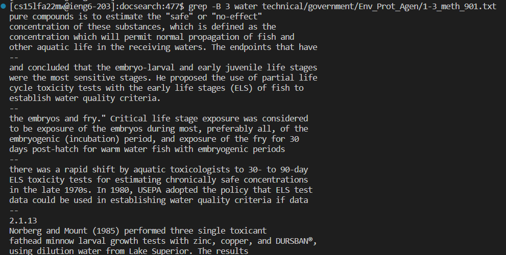  
```
grep -B 3 water technical/government/Env_Prot_Agen/1-3_meth_901.txt
pure compounds is to estimate the "safe" or "no-effect"
concentration of these substances, which is defined as the
concentration which will permit normal propagation of fish and
other aquatic life in the receiving waters. The endpoints that have
--
and concluded that the embryo-larval and early juvenile life stages
were the most sensitive stages. He proposed the use of partial life
cycle toxicity tests with the early life stages (ELS) of fish to
establish water quality criteria.
--
the embryos and fry." Critical life stage exposure was considered
to be exposure of the embryos during most, preferably all, of the
embryogenic (incubation) period, and exposure of the fry for 30
days post-hatch for warm water fish with embryogenic periods
--
there was a rapid shift by aquatic toxicologists to 30- to 90-day
ELS toxicity tests for estimating chronically safe concentrations
in the late 1970s. In 1980, USEPA adopted the policy that ELS test
data could be used in establishing water quality criteria if data
--
2.1.13
Norberg and Mount (1985) performed three single toxicant
fathead minnow larval growth tests with zinc, copper, and DURSBAN®,
using dilution water from Lake Superior. The results

The list continues...
```  

Here, we can see the topic discussed in this file that had water included in it in some kind. Since the term "water" is such a huge term, where many things can be done with water, the file could be about anything, such as drinking water, water transportation, fresh water in rivers, etc...

With thr `-A` and `-B` commands, we can see howw the topic of the file is generally is. We can see that this is somewhat involing animal life, most specifically freshwater life and fish. 

With `-R`, `-n`, `-A` and `-B`, we can use all these commands together to find information in a folder filled with information that would take tons of time to sort out though if done manually. With these simple commands, we can see which files we want to take a look at much more easier and quicker. 


